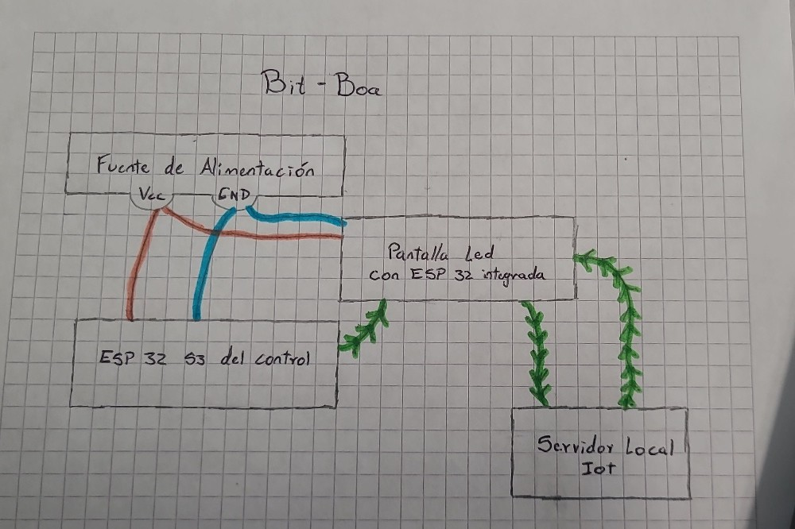

# BIT-BOA-ARCADE
### Integrantes:
        - Mateo Felipe Amaya Novoa
        - Samuel Esteban Quesada Portela
        - Angye Valentina Garcia Paramo
### Descripción :
    El proyecto es una imitacion a las maquinas de ARCADE antiguas, en la que se busca implementar tecnologias IOT con el manejo de microcontroladores como el modulo esp32 s3, donde se busca emular el juego de Snake.
    Consta de una pantalla led con esp32 s3 integrado, con un chasis de maquina retro antigua, y un control basandose el modelo de consola retro. 
    Con un servidor web donde se puede ver una interfaz de el puntaje de los jugadores, estableciendo un ranking ademas de poder ver como aumenta la puntuacion durante el juego y otros datos de la partida en tiempo real.

### Diagrama :
