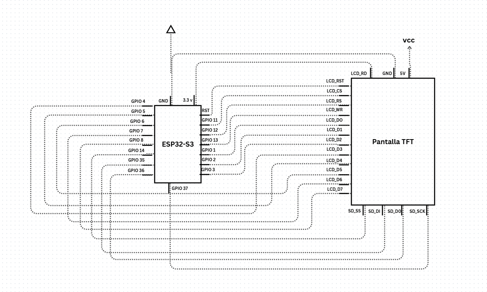
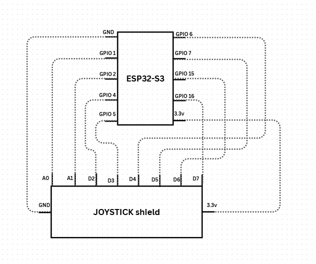

# BIT-BOA-ARCADE 🐍
## Integrantes:
- Mateo Felipe Amaya Novoa
- Samuel Esteban Quesada Portela
- Angye Valentina Garcia Paramo
## Descripción 🕹️ :
<<<<<<< HEAD

El proyecto es una imitacion a las maquinas de ARCADE antiguas, en la que se busca **implementar tecnologias IOT** con el manejo de microcontroladores como el modulo **esp32-s3**, donde se busca emular el juego de Snake.

Consta de una pantalla led con esp32-s3 integrado, con un chasis de maquina retro antigua, y un control basandose el modelo de consola retro. 

Con un servidor web donde se puede ver una interfaz de el puntaje de los jugadores, estableciendo un ranking ademas de poder ver como aumenta la puntuacion durante el juego y otros datos de la partida en tiempo real.

## Diagramas de conexión 📊 :
### *Diagrama ESP32-S3 "pantalla" a Pantalla TFT*:

### *Diagrama ESP32-S3 "control" a la placa  Joystick*:

## 📖 Descripcion de librerias: 
### 🛠️ Tecnologías y Librerías

El proyecto utiliza las siguientes dependencias para el control del hardware, la comunicación inalámbrica y la integración con la nube:

-  🖥️ Interfaz Gráfica y Pantalla
    - TFT_eSPI: Librería optimizada para el manejo de pantallas TFT color. Se utiliza para el renderizado de la lógica del juego y la interfaz de usuario en el ESP32.

-  🎮 Comunicación Inalámbrica
    - WiFi.h: Proporciona las capacidades de red del ESP32, permitiendo la conexión a puntos de acceso locales.

    - esp_now.h: Protocolo de comunicación de bajo consumo desarrollado por Espressif. Utilizado para la conexión de baja latencia entre mandos y la consola principal.

- ☁️ Integración con Firebase (Cloud)
    - Firebase_ESP_Client: Cliente completo para interactuar con Firebase. Gestiona la autenticación y el envío de datos en tiempo real.

